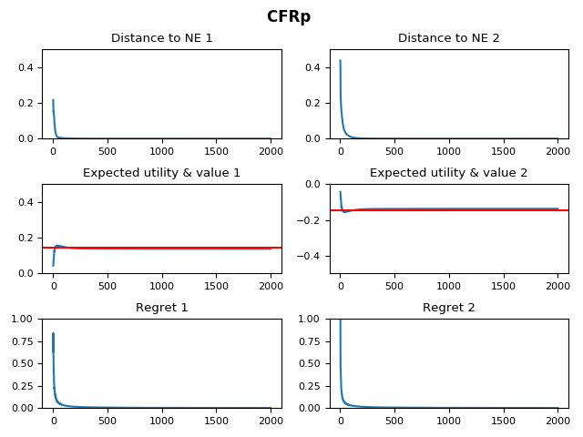

5 algorithms:
- EWF
- Exp3
- Exp3.P
- CFR
- CFR+

3 games:
- a modified Rock Paper Scissors (mRPS)
- a big normal form game with 15 actions (bNFG)
- Tic Tac Toe (TTT)

**Note: The chance player of CFR/CFR+ is not implemented.**

# Comparing EWF, Exp3, Exp3.P, CFR on mRPS

```
python main.py --game mRPS --algo EWF --eta .005 --iters 10000
```


```
python main.py --game mRPS --algo Exp3 --eta .005 --iters 10000
```


```
python main.py --game mRPS --algo Exp3P --eta .005 --gamma .01 --beta .05 --iters 10000
```


```
python main.py --game mRPS --algo CFR --iters 10000
```


# Comparing CFR, CFR+ on bNFG

```
python main.py --game bNFG --algo CFR --iters 2000
```


```
python main.py --game bNFG --algo CFRp --iters 2000
```



# Comparing CFR, CFR+ on TTT

```
python main.py --game TTT --algo CFR --iters 10
```


```
python main.py --game TTT --algo CFRp --iters 10
```

